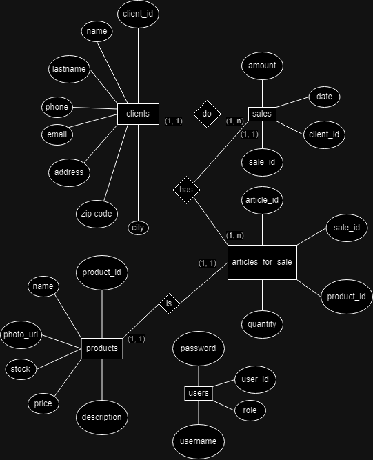
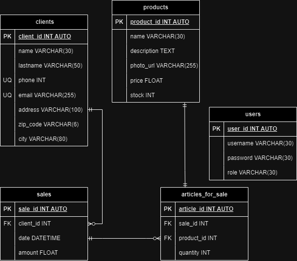

# eCommerce

## Entities List

### clients **(ED)**

- client_id **(PK)**
- name
- lastname
- phone **(UQ)**
- email **(UQ)**
- address
- zip_code
- city

### products **(ED|EC)**

- product_id **(PK)**
- name
- description
- photo_url
- price
- stock

### sales **(ED)**

- sale_id **(PK)**
- client_id **(FK)**
- date
- amount

### articles_for_sale **(EP)**

- article_id **(PK)**
- sale_id **(FK)**
- product_id **(FK)**
- quantity

### users

- user_id **(PK)**
- username **(UQ)**
- password
- role

## Relationships

1. A **client** do a **sale** (_1 - n_).
1. A **sale** has **articles** (_1 - n_).
1. An **article** is a **product** (_1 - 1_).

## Diagrams

### Entity-relationship model

### Relational model

## CRUD

### clients

1. Create a client.
1. Get all clients.
1. Get a client.
1. Update a client.
1. Delete a client.

### products

1. Create a product.
1. Get all products
1. Get a product.
1. Update a product.
1. Delete a product.
1. Each time there is a sale, subtract from the number of products available, the number of items that were sold..

### sales

1. Create a sale.
1. Get all sales
1. Get a sale.
1. Update a sale.
1. Delete a sale.
1. Get all sales from a client.
1. Get all sales from a product.

### articles_for_sale

1. Create a article.
1. Get all articles
1. Get a article.
1. Update a article.
1. Delete a article.
1. Get all articles from a sale.
1. Get all articles from a product.
1. Get all articles from a client.
